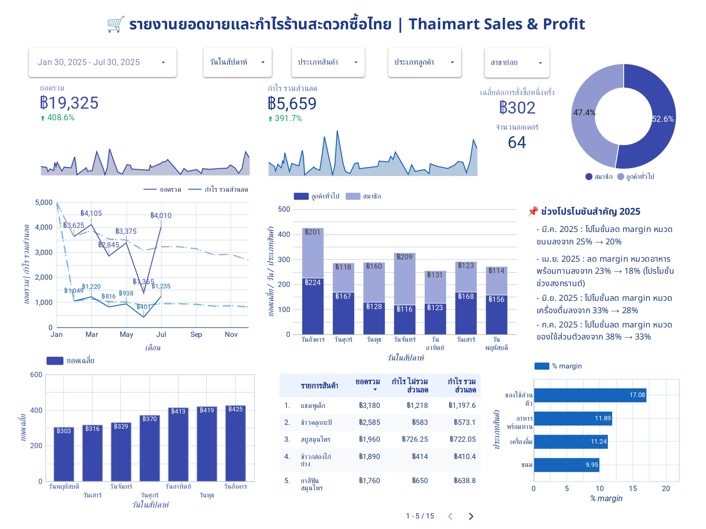

#### thaimart-sales-dashboard
# Thaimart Sales & Profit Dashboard (Jan–Jul 2025)

> This mock project simulates sales data for a multi-branch convenience store (“Thaimart”) and visualizes sales, profit and customer behavior in order to support business decision-making.
> BI project built for practices, data analysis and visualization, using Google Looker Studio.

### Why I Built this
I created this mock BI project to practice, simulate end-to-end BI workflow, turning raw transactions to cleaning and organizing using Google Sheet to interactive dashboard and creating insight using Looker Studio.  

โปรเจกต์นี้ทำขึ้นเพื่อฝึกจำลองสถานการณ์จริง (เช่น โปรโมชั่นตามช่วงเวลา/เทศกาล, พฤติกรรมของลูกค้าแบบสมาชิก/ทั่วไป, เปรียบเทียบยอดขาย Q1 และ Q2) และช่วยฝึกการนำเสนอข้อมูลผ่าน Looker Studio เพื่อให้ผู้บริหารสามารถตีความข้อมูลได้ง่าย

This project gave me the opportunity to:
- Practice transforming raw sales data into **business insights**  
- Develop hands-on skill in **Looker Studio**, including filters, comparison periods, margin logic  
- Simulate a realistic use-case: “What happens to sales and profit when a promotion reduces the margin?”

### Objective
- Track **sales** and **profit** by branch, product category and customer type  
- Compare **pre- and post-promotion** performance (Songkran promotion in Apr-2025)  
- Identify high-margin product categories and customer behavior patterns

### Key Features

| Item | Description |
|------|---------------------------------------------|
| KPI Cards |- Total Sales / Total Profit / Avg Order Value *(ยอดขายรวม / กำไรรวม / มูลค่าต่อบิลเฉลี่ย)* |
| Time Trend | Monthly sales + profit trend (Jan–Jul 2025) *(แนวโน้มยอดขายรายเดือน)*|
| Category Breakdown | Sales and Profit by Product Category *(แยกตามหมวดสินค้า เช่น อาหารพร้อมทาน / ขนม ฯลฯ)*|
| Customer Segmentation | Members vs Non-Members (pie + filter) *(กราฟเปรียบเทียบลูกค้าสมาชิกและลูกค้าทั่วไป)* |
| Promotion Impact | Q2 vs Q1 comparison (Ready-to-eat category) *(เปรียบเทียบก่อน/หลังช่วงโปรโมชั่นสงกรานต์)*|
| Profit Margin | % margin by category (Profit ÷ SalesAmount) *(อัตรากำไรขั้นต้นของแต่ละหมวดสินค้า)*|

---
### Key Insights (Example Findings)
- Ready-to-eat category sales declined by 19.3% in Q2 (Apr–Jun) compared to Q1.
- Total profit in Q2 was slightly lower (−0.9%) than Q1, suggesting that the Songkran campaign helped sustain performance despite lower promotion margins.
- Personal care has the highest profit margin (~20.9%), while snacks have the lowest (~12.5%).
- Non-members spend about 2.8% more per order than members, contrary to expectations.
- ยอดขายหมวดอาหารพร้อมทานในไตรมาส 2 (เม.ย.–มิ.ย.) ลดลง 19.3% เมื่อเทียบกับไตรมาส 1
- กำไรรวม ในไตรมาส 2 ลดลงเล็กน้อย (−0.9%) เมื่อเทียบกับไตรมาส 1 สะท้อนว่าแคมเปญสงกรานต์ยังช่วยรักษากำไรได้แม้จะมีมาร์จิ้นจากโปรโมชันที่ต่ำลง
- หมวดของใช้ส่วนตัวมีอัตรากำไรสูงสุด (~20.9%) ในขณะที่หมวดขนมมีอัตรากำไรต่ำที่สุด (~12.5%)
- ลูกค้าทั่วไป (ไม่เป็นสมาชิก) ใช้จ่ายต่อคำสั่งซื้อโดยเฉลี่ย มากกว่าลูกค้าที่มีสมาชิกประมาณ 2.8% ซึ่งขัดกับที่คาดไว้
> หมายเหตุ: สามารถปรับ Filter (เช่น ประเภทสินค้า / สาขา / ลูกค้า) เพื่อสำรวจ Insight เพิ่มเติมได้

---
### Project Assets (View Only)
- Interactive Dashboard (Looker Studio)👉 https://lookerstudio.google.com/reporting/95ba1816-6712-4ef0-acba-46924c7ddaa6
- Mock Sales Dataset (Google Sheets) 👉 https://docs.google.com/spreadsheets/d/1HAAC5BiBYV9Q6Z02oJ6h9EQma1_SbQ2htWz4JnGsAFA/edit?usp=sharing

> “This dataset is mock data created for practice purposes. It simulates ~200 transactions across 10 branches, with reference tables for product categories and customer types.”
---
### Tools Used

- Google Looker Studio (Dashboard & Visualization)
- Google Sheets (Data cleaning and enrichment)
- ChatGPT (Prompt-based business insight guidance)
---
### Dataset (Mock)
| Field | Description |
|------|-------------------------------|
| InvoiceID | Transaction ID (multi-item invoices) |
| CustomerID | Member ID _(blank = non-member)_ |
| Date / Time | Transaction timestamp |
| Branch & Sub-branch | Store location |
| Category / Product | Product categories and items |
| Qty, Unit Price | Transaction details |
| **SalesAmount** | Total revenue |
| **Profit** | Based on seasonal margin logic |

---
### Margin Logic (Summary)
| Period | Category | Margin Change |
|--------|---------------------------|----------------------------|
| Mar-2025 | Snacks | 30% → 25% (Snack Promotion) |
| Apr-2025 | Ready-to-eat | 25% → 18% (Songkran) |
| Jun-2025 | Drinks | 35% → 33% (Summer Drink Promo) |
---
